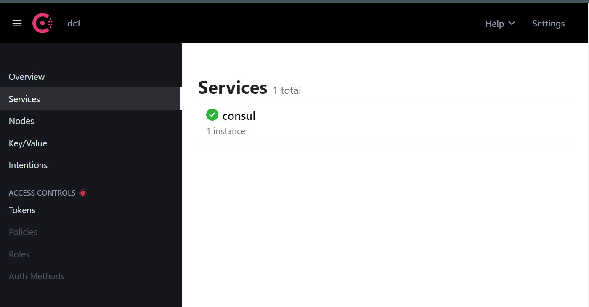
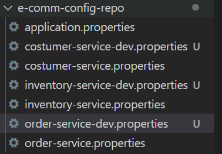
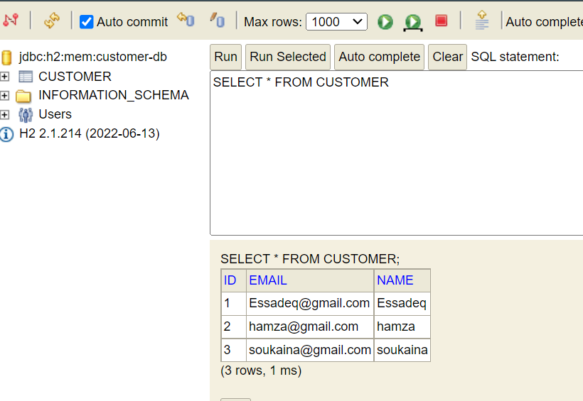
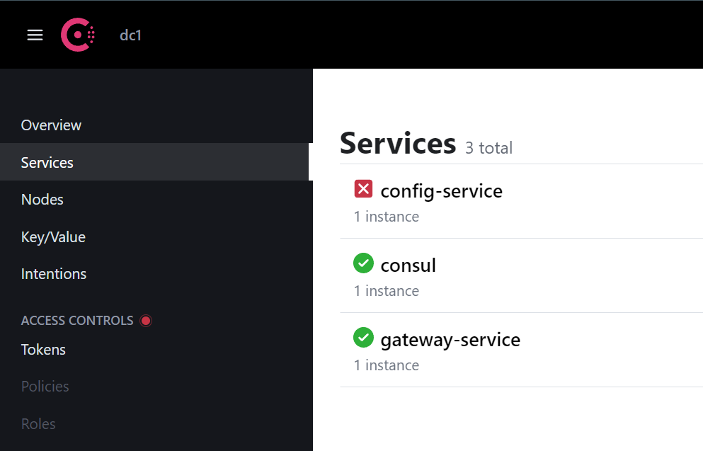
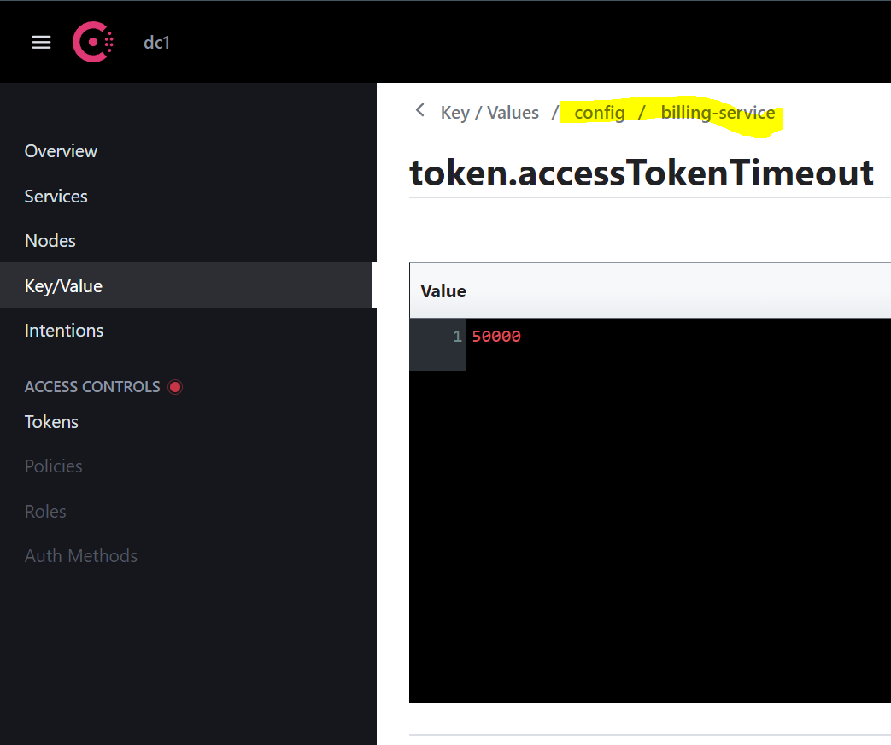
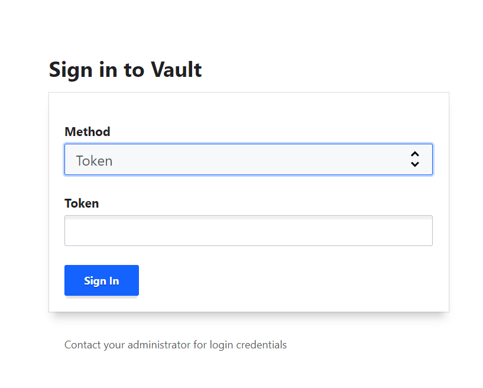
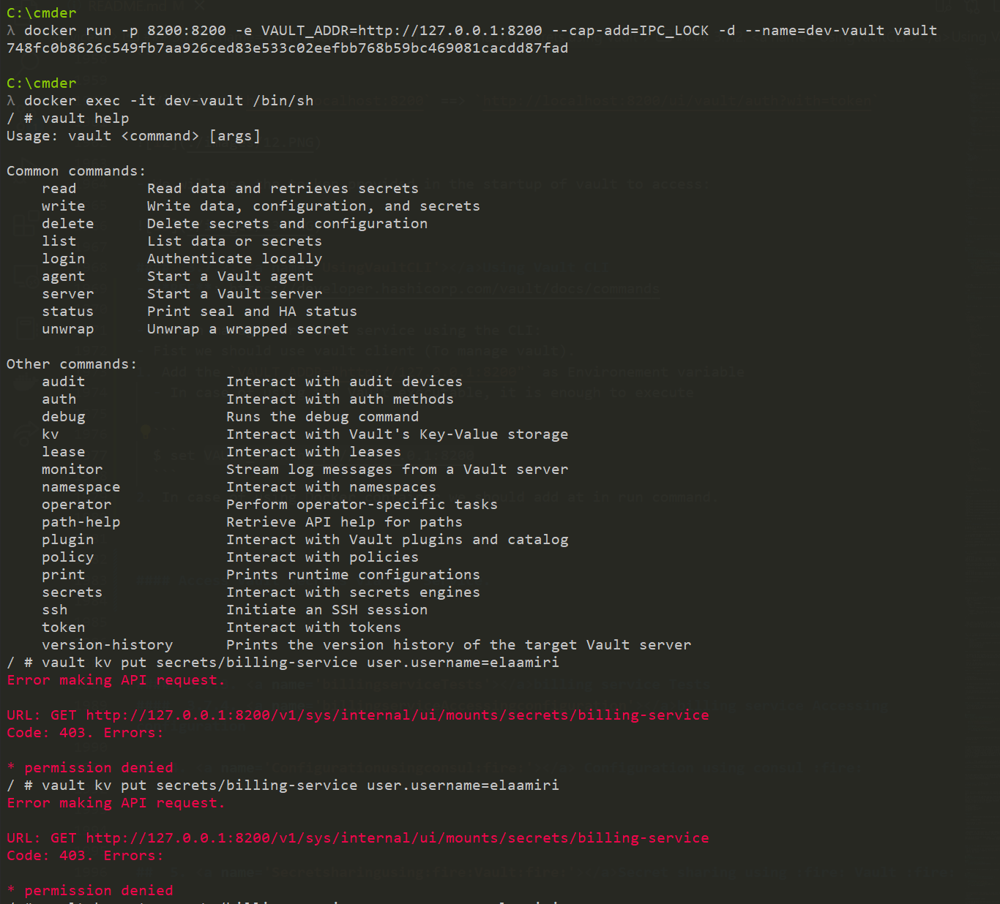
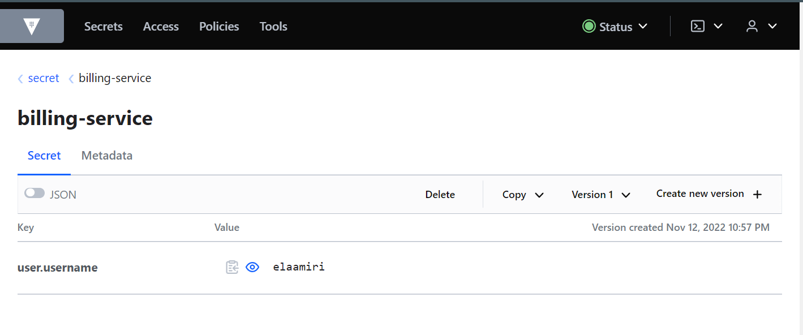

<!-- vscode-markdown-toc -->
* 1. [The use case](#Theusecase)
* 2. [Technical services](#Technicalservices)
	* 2.1. [Consul Discovery service](#ConsulDiscoveryservice)
	* 2.2. [Configuration service](#Configurationservice)
		* 2.2.1. [Config service dependencies](#Configservicedependencies)
		* 2.2.2. [ Activating config service](#Activatingconfigservice)
		* 2.2.3. [ Config service properties](#Configserviceproperties)
		* 2.2.4. [ Config service repo and files](#Configservicerepoandfiles)
		* 2.2.5. [Tests](#Tests)
		* 2.2.6. [How to use it ?](#Howtouseit)
	* 2.3. [Gateway service](#Gatewayservice)
		* 2.3.1. [Gateway service Dependencies](#GatewayserviceDependencies)
		* 2.3.2. [Gateway service properties](#Gatewayserviceproperties)
		* 2.3.3. [Dynamic routing](#Dynamicrouting)
		* 2.3.4. [Gateway test](#Gatewaytest)
* 3. [Business services (Functional services)](#BusinessservicesFunctionalservices)
	* 3.1. [Customer service](#Customerservice)
		* 3.1.1. [Customer service Dependencies](#CustomerserviceDependencies)
		* 3.1.2. [Customer service properties](#Customerserviceproperties)
		* 3.1.3. [Customer service RestRepository](#CustomerserviceRestRepository)
		* 3.1.4. [Customer service Projections](#CustomerserviceProjections)
		* 3.1.5. [Customer service Tests](#CustomerserviceTests)
		* 3.1.6. [Customer service Accessing configuration](#CustomerserviceAccessingconfiguration)
	* 3.2. [Inventory service](#Inventoryservice)
		* 3.2.1. [Inventory service Dependencies](#InventoryserviceDependencies)
		* 3.2.2. [Inventory service properties](#Inventoryserviceproperties)
		* 3.2.3. [Inventory service RestRepository](#InventoryserviceRestRepository)
		* 3.2.4. [Inventory service Projections](#InventoryserviceProjections)
		* 3.2.5. [Inventory service Tests](#InventoryserviceTests)
	* 3.3. [Order service](#Orderservice)
		* 3.3.1. [Order service Dependencies](#OrderserviceDependencies)
		* 3.3.2. [Order service properties](#Orderserviceproperties)
		* 3.3.3. [Order service RestRepository](#OrderserviceRestRepository)
		* 3.3.4. [Connecting Order service with other service using `OpenFeign`](#ConnectingOrderservicewithotherserviceusingOpenFeign)
		* 3.3.5. [Order service Projections](#OrderserviceProjections)
		* 3.3.6. [Order service Tests](#OrderserviceTests)
		* 3.3.7. [Order service Creating a Rest Controller](#OrderserviceCreatingaRestController)
	* 3.4. [Consul What is happening ?](#ConsulWhatishappening)
	* 3.5. [OpenFeign Logging  (Journalisation)](#OpenFeignLoggingJournalisation)
	* 3.6. [billing service](#billingservice)
		* 3.6.1. [billing service Dependencies](#billingserviceDependencies)
		* 3.6.2. [Using Consul as Config service](#UsingConsulasConfigservice)
		* 3.6.3. [billing service Properties](#billingserviceProperties)
		* 3.6.4. [Read and consume Consul Config in our service.](#ReadandconsumeConsulConfiginourservice.)
		* 3.6.5. [Injecting configuration best practice](#Injectingconfigurationbestpractice)
	* 3.7. [Sharing secrets using Vault](#SharingsecretsusingVault)
		* 3.7.1. [Vault installing](#Vaultinstalling)
		* 3.7.2. [Using Vault](#UsingVault)
		* 3.7.3. [Vault CLI](#VaultCLI)
		* 3.7.4. [Vault UI interface](#VaultUIinterface)
		* 3.7.5. [Access Vault Secrets via our Service.](#AccessVaultSecretsviaourService.)
		* 3.7.6. [Adding Vault Secrets via our Service.](#AddingVaultSecretsviaourService.)
	* 3.8. [Resilience4J](#Resilience4J)
* 4. [Front-end](#Front-end)

<!-- vscode-markdown-toc-config
	numbering=true
	autoSave=true
	/vscode-markdown-toc-config -->
<!-- /vscode-markdown-toc -->

# Microservices-architecture-spring-cloud-use-case


##  1. <a name='Theusecase'></a>The use case 


Just to make thing easy to navigate between the microservices without the need to open a new window for each one we can in Intellij Idea 
1. `create a project ` (empty one).
2. Add the projects as modules to the empty project `Add new Module from existing source`.


##  2. <a name='Technicalservices'></a>Technical services 

###  2.1. <a name='ConsulDiscoveryservice'></a>Consul Discovery service
We will create it as a micro-service, because it is available as a `jar` executable file or, a docker image 
- Website : https://www.consul.io/
- As jar file [v1.13.3 (latest version 2022-11-06)]: https://releases.hashicorp.com/consul/1.13.3/consul_1.13.3_windows_386.zip
- As Docker image: https://hub.docker.com/_/consul

- Pulling the image :
```
$ docker pull consul
```

- Run it in dev mode (UI):
```
$ docker run -d -p 8500:8500 -p 8600:8600/udp --name=my-consul consul agent -server -ui -node=server-1 -bootstrap-expect=1 -client=0.0.0.0

```
- Visiting `http://localhost:8500` (`http://localhost:8500/ui/dc1/services`)




- **Consul** is reactive : means that if it is rebooted, the services detect it and register automatically

###  2.2. <a name='Configurationservice'></a>Configuration service
####  2.2.1. <a name='Configservicedependencies'></a>Config service dependencies 
    - Config Server
    - Spring boot Actuator
    - Consul Discovery
####  2.2.2. <a name='Activatingconfigservice'></a> Activating config service

```java
@SpringBootApplication
@EnableConfigServer
public class ECommConfigServiceApplication {

	public static void main(String[] args) {
		SpringApplication.run(ECommConfigServiceApplication.class, args);
	}

}

```
####  2.2.3. <a name='Configserviceproperties'></a> Config service properties 

```properties
server.port=8888
spring.application.name=config-service
## referring to a local github repo to control the config versions
spring.cloud.config.server.git.uri=file:///C:/Users/elaam/IdeaProjects/microservices-architecture-spring-cloud-use-case/e-comm-config-repo
```
####  2.2.4. <a name='Configservicerepoandfiles'></a> Config service repo and files  

- Above the path `path` is refering to the configuration repository that we use to store the configuration.
- We used a local path (file protocol), but we can use any other way to access our config(remote repo for example...).
- It should be an external repository (Outside the microservice)
- And it should be a git repostory to follow and control the configuration history (versionning)|[Detecting changes].
- We can initialize the git repo by `$ git init`
- The repo holds the global config, which is shared between all the microservices and custom congif for each one we want :


- We can also create a config file for the developement and one other for production and other for test for example (`Custom config files for each environment`)



- Here our config-service is on the consul dashboard .But, there is aproblem (Exception):

<pre>
...
org.springframework.cloud.config.server.environment.NoSuchLabelException: No such label: master
...
</pre>
- **Solution** : we sould just `git add` our files and `git commit` them.
- The service will be registred implicitlly to consul, but we can force that with :

```java

@SpringBootApplication
@EnableConfigServer
@EnableDiscoveryClient // Enable Register to discovery server 
public class ECommConfigServiceApplication {

	public static void main(String[] args) {
		SpringApplication.run(ECommConfigServiceApplication.class, args);
	}
}

```
- Now we can access the configuration via `http://localhost:8888/<service-name>/<environment>`
- Here the result of visiting  `http://localhost:8888/customer-service/dev`:

```json
{
  "name": "customer-service",
  "profiles": [
    "dev"
  ],
  "label": null,
  "version": "dec25c8ed68c614619d3a7249f397c8842eb004a",
  "state": null,
  "propertySources": [
    {
      "name": "file:///C:/Users/elaam/IdeaProjects/microservices-architecture-spring-cloud-use-case/e-comm-config-repo/file:C:\\Users\\elaam\\IdeaProjects\\microservices-architecture-spring-cloud-use-case\\e-comm-config-repo\\application.properties",
      "source": {
        "global.parmas.globlaName": "e-comm-enset"
      }
    }
  ]
}
```
- We can return `default`, `dev`, `prod` ... configuration just by changing the `<environement>` 

####  2.2.5. <a name='Tests'></a>Tests

- Visit `http://localhost:8888/inventory-service/dev` 

<details>

```json
{
  "name": "inventory-service",
  "profiles": [
    "dev"
  ],
  "label": null,
  "version": "07c770e67a73facb14e6998017faa925b267dc77",
  "state": null,
  "propertySources": [
    {
      "name": "file:///C:/Users/elaam/IdeaProjects/microservices-architecture-spring-cloud-use-case/e-comm-config-repo/file:C:\\Users\\elaam\\IdeaProjects\\microservices-architecture-spring-cloud-use-case\\e-comm-config-repo\\inventory-service-dev.properties",
      "source": {
        "inventory.params.inv1": "4500"
      }
    },
    {
      "name": "file:///C:/Users/elaam/IdeaProjects/microservices-architecture-spring-cloud-use-case/e-comm-config-repo/file:C:\\Users\\elaam\\IdeaProjects\\microservices-architecture-spring-cloud-use-case\\e-comm-config-repo\\application.properties",
      "source": {
        "global.parmas.globlaName": "e-comm-enset"
      }
    }
  ]
}
```

</details>

- Visit `http://localhost:8888/inventory-service/prod` 

<details>

```json
{
  "name": "inventory-service",
  "profiles": [
    "prod"
  ],
  "label": null,
  "version": "07c770e67a73facb14e6998017faa925b267dc77",
  "state": null,
  "propertySources": [
    {
      "name": "file:///C:/Users/elaam/IdeaProjects/microservices-architecture-spring-cloud-use-case/e-comm-config-repo/file:C:\\Users\\elaam\\IdeaProjects\\microservices-architecture-spring-cloud-use-case\\e-comm-config-repo\\inventory-service-prod.properties",
      "source": {
        "inventory.params.inv1": "4500"
      }
    },
    {
      "name": "file:///C:/Users/elaam/IdeaProjects/microservices-architecture-spring-cloud-use-case/e-comm-config-repo/file:C:\\Users\\elaam\\IdeaProjects\\microservices-architecture-spring-cloud-use-case\\e-comm-config-repo\\application.properties",
      "source": {
        "global.parmas.globlaName": "e-comm-enset"
      }
    }
  ]
}
```

</details>

- Visiting : `http://localhost:8888/application/default`
- Returns the global config 

<details>

```json
{
  "name": "application",
  "profiles": [
    "default"
  ],
  "label": null,
  "version": "07c770e67a73facb14e6998017faa925b267dc77",
  "state": null,
  "propertySources": [
    {
      "name": "file:///C:/Users/elaam/IdeaProjects/microservices-architecture-spring-cloud-use-case/e-comm-config-repo/file:C:\\Users\\elaam\\IdeaProjects\\microservices-architecture-spring-cloud-use-case\\e-comm-config-repo\\application.properties",
      "source": {
        "global.parmas.globlaName": "e-comm-enset"
      }
    }
  ]
}
```

</details>

####  2.2.6. <a name='Howtouseit'></a>How to use it ?
- In the functional services, we have to add the ability to seach the config to the service
- The dependency `config client` will help us in that.
- We just use the property : `spring.config.import=optional:configserver:http://localhost:8888`
- Now the service will seach its configuration in the config server via `http://localhost:8888`
- See that in details here => [customer service](#Customerservice)


###  2.3. <a name='Gatewayservice'></a>Gateway service
####  2.3.1. <a name='GatewayserviceDependencies'></a>Gateway service Dependencies 
    - Spring Cloud Gateway
    - Consul Discovery : to register in the dicovery service
    - Spring boot Actuator
    - Spring cloud Config

####  2.3.2. <a name='Gatewayserviceproperties'></a>Gateway service properties
```properties
server.port=8989
spring.application.name=gateway-service
management.endpoints.web.exposure.include=*

## for the rest of properties search here 
spring.config.import=optional:configserver:http://localhost:8888 // from where getting the config
```

####  2.3.3. <a name='Dynamicrouting'></a>Dynamic routing 
- Creating our `DiscoveryClientRouteDefinitionLocator` in the Application

```java
@SpringBootApplication
public class ECommGatewayServiceApplication {

	public static void main(String[] args) {
		SpringApplication.run(ECommGatewayServiceApplication.class, args);
	}
	@Bean
	DiscoveryClientRouteDefinitionLocator dynamicRouting(ReactiveDiscoveryClient reactiveDiscoveryClient,
														 DiscoveryLocatorProperties discoveryLocatorProperties){
		return new DiscoveryClientRouteDefinitionLocator(reactiveDiscoveryClient, discoveryLocatorProperties);
	}
}
```

####  2.3.4. <a name='Gatewaytest'></a>Gateway test
- Visiting : `http://localhost:8989/gateway-service/customer-service`

```json
{
  "_links" : {
    "customers" : {
      "href" : "http://localhost:8081/customers{?page,size,sort}",
      "templated" : true
    },
    "profile" : {
      "href" : "http://localhost:8081/profile"
    }
  }
}
```
- Visiting `http://localhost:8989/gateway-service/customer-service/customers`:

<details>

```json
{
  "_embedded" : {
    "customers" : [ {
      "name" : "Essadeq",
      "email" : "Essadeq@gmail.com",
      "_links" : {
        "self" : {
          "href" : "http://localhost:8081/customers/1"
        },
        "customer" : {
          "href" : "http://localhost:8081/customers/1"
        }
      }
    }, {
      "name" : "hamza",
      "email" : "hamza@gmail.com",
      "_links" : {
        "self" : {
          "href" : "http://localhost:8081/customers/2"
        },
        "customer" : {
          "href" : "http://localhost:8081/customers/2"
        }
      }
    }, {
      "name" : "soukaina",
      "email" : "soukaina@gmail.com",
      "_links" : {
        "self" : {
          "href" : "http://localhost:8081/customers/3"
        },
        "customer" : {
          "href" : "http://localhost:8081/customers/3"
        }
      }
    } ]
  },
  "_links" : {
    "self" : {
      "href" : "http://localhost:8081/customers"
    },
    "profile" : {
      "href" : "http://localhost:8081/profile/customers"
    }
  },
  "page" : {
    "size" : 20,
    "totalElements" : 3,
    "totalPages" : 1,
    "number" : 0
  }
}
```
</details>

- getting the configuration by Visiting : `http://localhost:8989/gateway-service/customer-service/configParams`

```json
{"globalName":"e-comm-enset","c1":"defaultvalue3"}
```


[TOP](#1-the-use-case)

---------------------------------------------

##  3. <a name='BusinessservicesFunctionalservices'></a>Business services (Functional services)

###  3.1. <a name='Customerservice'></a>Customer service
####  3.1.1. <a name='CustomerserviceDependencies'></a>Customer service Dependencies 
    - Spring Web
    - Spring Data Jpa
    - H2 Database
    - Lombok
    - Rest Repositories
    - Consul Discovery : to register in the dicovery service
    - Config client : to find its configuration
    - Spring boot Actuator

####  3.1.2. <a name='Customerserviceproperties'></a>Customer service properties

```properties
server.port=8081
spring.application.name=customer-service
management.endpoints.web.exposure.include=*
spring.config.import=optional:configserver:http://localhost:8888 // from where getting the config

```
####  3.1.3. <a name='CustomerserviceRestRepository'></a>Customer service RestRepository

- The  Customer entity 

```java
@Entity
@Data  @AllArgsConstructor @NoArgsConstructor
@Builder
public class Customer {
    @Id
    @GeneratedValue(strategy = GenerationType.IDENTITY)
    private Long id;
    private String name;
    private String email;
}

```
- the Customer rest repo 

```java
@RepositoryRestResource
public interface CustomerRepository extends JpaRepository<Customer, Long> {
}

```

####  3.1.4. <a name='CustomerserviceProjections'></a>Customer service Projections

- CustomerProjection 

```java
@Projection(name = "fullCustomer", types = Customer.class)
public interface CustomerProjection {
    Long getId();
    String getName();
    String getEmail();
}

```

- :fire: Does not return what should be returned (No Ids there) when visiting : `http://localhost:8989/gateway-service/customer-service/customers/1/?projection=fullCustomer` !!! 

- :fire: **Solution** : 

<pre>
How does Spring Data REST finds projection definitions?

Any @Projection interface found in the same package as your entity definitions (or one of it’s 
sub-packages) is registered.

You can manually register via RepositoryRestConfiguration.getProjectionConfiguration().
addProjection(…).

In either situation, the interface with your projection MUST have the @Projection annotation.
</pre>

- http://docs.spring.io/spring-data/rest/docs/current/reference/html/#projections-excerpts.projections


####  3.1.5. <a name='CustomerserviceTests'></a>Customer service Tests

- Adding some customers at the begining :

```java
@Bean
	CommandLineRunner start(CustomerRepository customerRepository){
		return args -> {
			List.of("Essadeq", "hamza", "soukaina").forEach(s -> {
				Customer customer = Customer.builder()
						.name(s)
						.email(String.format("%s@gmail.com", s))
						.build();
				customerRepository.save(customer);
			});
		};
	}
```
- The result



- Visiting : `http://localhost:8081/customers`

<details>

```json
{
  "_embedded" : {
    "customers" : [ {
      "name" : "Essadeq",
      "email" : "Essadeq@gmail.com",
      "_links" : {
        "self" : {
          "href" : "http://localhost:8081/customers/1"
        },
        "customer" : {
          "href" : "http://localhost:8081/customers/1"
        }
      }
    }, {
      "name" : "hamza",
      "email" : "hamza@gmail.com",
      "_links" : {
        "self" : {
          "href" : "http://localhost:8081/customers/2"
        },
        "customer" : {
          "href" : "http://localhost:8081/customers/2"
        }
      }
    }, {
      "name" : "soukaina",
      "email" : "soukaina@gmail.com",
      "_links" : {
        "self" : {
          "href" : "http://localhost:8081/customers/3"
        },
        "customer" : {
          "href" : "http://localhost:8081/customers/3"
        }
      }
    } ]
  },
  "_links" : {
    "self" : {
      "href" : "http://localhost:8081/customers"
    },
    "profile" : {
      "href" : "http://localhost:8081/profile/customers"
    }
  },
  "page" : {
    "size" : 20,
    "totalElements" : 3,
    "totalPages" : 1,
    "number" : 0
  }
}
```
</details>

- Testing with projections , visiting : `http://localhost:8989/gateway-service/customer-service/customers/1/?projection=fullCustomer`

```json
{
  "name" : "Essadeq",
  "id" : 1,
  "email" : "Essadeq@gmail.com",
  "_links" : {
    "self" : {
      "href" : "http://DESKTOP-NH5SQQL:8081/customers/1"
    },
    "customer" : {
      "href" : "http://DESKTOP-NH5SQQL:8081/customers/1{?projection}",
      "templated" : true
    }
  }
}
```

- That means that: :airplane:
    -  Our Config server is working well
    -  Our Customer service is recognizing the configuration
    -  Everything here is fine


####  3.1.6. <a name='CustomerserviceAccessingconfiguration'></a>Customer service Accessing configuration
- We will try to access the config via a `CustomerConfigTestController` class in `web` repo.

```java
package me.elaamiri.ecommcustomerservice.web;
...
@RestController
public class CustomerConfigTestController {
    // Injecting the configuration values
    @Value("${customer.params.c1}")
    private String c1; //  param
    @Value("${global.parmas.globlaName}")
    private String globalName; //  param

    @GetMapping("/configParams")
    Map<String, String> getConfigParams(){
        return Map.of("c1", c1, "globalName", globalName); //java 17
    }
}

```
- In a normal case where everything works as it should does, we should have this result when we visit : `http://localhost:8081/configParams`

```json
{"globalName":"e-comm-enset","c1":"defaultvalue"}
```

- By `@Value("${global.parmas.globlaName}")` we inject the value of the param  `global.parmas.globlaName` from the configuration files to the variable `private String c1;`

- The value `defaultvalue` injected to `c1`, because it is the default value and we did not specify the environment..

- :warning: be careful with the names of the config files, they should be the same as the services names.

- After every change in the configuration we should `add` and `commit` it, but, we can not see the changes :
- **Solutions** : :fire::fire:
    1. Rerun the microservice (Not recommanded)
    2. Use the `Refresh Actuator EndPoint` to refresh our service and so it loads the new config:
        - By this EndPoint we can demand to our service to do a `Refresh`
        1. In our controller we add Actuator annotation `@RefreshScope`
        - Now when we change the config, we will able to refresh our srevice by sending a `POST` request:
        ```http
        POST http://localhost:8081/actuator/refresh
        ```
        - :warning: Thre request will return a `404` error, so to avoid that we should add the property `management.endpoints.web.exposure.include=*` to the properties file of our service.
        - That Enables All Endpoints in Spring Boot Actuator via HTTP
        - For more info : https://docs.spring.io/spring-boot/docs/2.1.11.RELEASE/reference/html/production-ready-endpoints.html
        

        <pre>
        You can invoke the refresh Actuator endpoint by sending 
        an empty HTTP POST to the client's refresh endpoint:
        http://localhost:<port>/actuator/refresh .
        </pre>
    - Now when I refreshed the service using the `Actuator refresh endpoint`, via `POST http://localhost:8081/actuator/refresh `
    I got the result :

    ```
    HTTP/1.1 200 
    Content-Type: application/vnd.spring-boot.actuator.v3+json
    Transfer-Encoding: chunked
    Date: Sun, 06 Nov 2022 13:09:34 GMT
    Connection: close

    [
    "config.client.version",
    "customer.params.c1"
    ]
    ```
    - And the service recognized the new changes in the config service.
    - Actuator returns the changer params (because I changed `customer.params.c1` and I commit it)
    - HTTP file : [HTTP FILE ](./http-requests.http)

    - --> **Configuration à chaud** :fr:
- For the 
```properties 
spring.datasource.url=jdbc:h2:mem:customer-db
spring.h2.console.enabled=true
```
- We added them to the `customer-service.properties` in the Config repo, so they will be managed by the config server.


###  3.2. <a name='Inventoryservice'></a>Inventory service
####  3.2.1. <a name='InventoryserviceDependencies'></a>Inventory service Dependencies 
    - Spring Web
    - Spring Data Jpa
    - H2 Database
    - Lombok
    - Rest Repositories
    - Consul Discovery : to register in the dicovery service
    - Config client : to find its configuration
    - Spring boot Actuator

####  3.2.2. <a name='Inventoryserviceproperties'></a>Inventory service properties

```properties 
server.port=8082
spring.application.name=inventory-service
management.endpoints.web.exposure.include=*
spring.config.import=optional:configserver:http://localhost:8888 // from where getting the config

```
- We should not forget to add 

```
spring.datasource.url=jdbc:h2:mem:product-db
spring.h2.console.enabled=true
```

To the config files of Inventory service in the config server
- `inventory-service-dev.properties` ..
- :warning: **The config files should have the same name as the service(Name provided in `spring.application.name` property)** :warning:

####  3.2.3. <a name='InventoryserviceRestRepository'></a>Inventory service RestRepository

-Product entity 
```java
@Entity
@Data @AllArgsConstructor @NoArgsConstructor @Builder
public class Product {
    @Id
    @GeneratedValue(strategy = GenerationType.IDENTITY)
    private Long id;
    private String name;
    private double price;
    private int quantity;
}
```

- Product Rest repository
```java
@RepositoryRestResource
public interface ProductRepository extends JpaRepository<Product, Long> {
}

```

####  3.2.4. <a name='InventoryserviceProjections'></a>Inventory service Projections

- Adding a projection :airplane: **[Must be in the same package as the Entity or in a subpackage]**

```java
@Projection(name = "fullProduct", types = Product.class)
public interface ProductProjection {
    public Long getId();
    public String getName();
    public double getPrice();
    public int getQuantity();
}
```

####  3.2.5. <a name='InventoryserviceTests'></a>Inventory service Tests
- Adding some test data

```java
@SpringBootApplication
@EnableDiscoveryClient // not necessary 
public class ECommInventoryServiceApplication {

	public static void main(String[] args) {
		SpringApplication.run(ECommInventoryServiceApplication.class, args);
	}

	@Bean
	CommandLineRunner start(ProductRepository productRepository){
		return args -> {
			List.of("IMACX15", "Lenovo X14", "Infinix142", "R74", "XLa77").forEach(s -> {
				Product product = Product.builder()
						.name(s)
						.price((new Random()).nextDouble(500, 5000))
						.quantity((new Random()).nextInt(12,55))
						.build();
				productRepository.save(product);
			});
		};
	}
}
```
- Visiting : `http://localhost:8082/products/1`

```json
{
  "name" : "IMACX15",
  "price" : 1067.7846596528238,
  "quantity" : 54,
  "_links" : {
    "self" : {
      "href" : "http://localhost:8082/products/1"
    },
    "product" : {
      "href" : "http://localhost:8082/products/1"
    }
  }
}
```

- Visiting `http://localhost:8989/gateway-service/inventory-service/products/3` | Gateway

```json
{
  "name" : "Infinix142",
  "price" : 821.6061146943723,
  "quantity" : 36,
  "_links" : {
    "self" : {
      "href" : "http://DESKTOP-NH5SQQL:8082/products/3"
    },
    "product" : {
      "href" : "http://DESKTOP-NH5SQQL:8082/products/3"
    }
  }
}
```

- testing projection | visiting : `http://localhost:8989/gateway-service/inventory-service/products/2?projection=fullProduct`

```json
{
  "name" : "Lenovo X14",
  "id" : 2,
  "price" : 1924.1412262701892,
  "quantity" : 22,
  "_links" : {
    "self" : {
      "href" : "http://DESKTOP-NH5SQQL:8082/products/2"
    },
    "product" : {
      "href" : "http://DESKTOP-NH5SQQL:8082/products/2{?projection}",
      "templated" : true
    }
  }
}
```


###  3.3. <a name='Orderservice'></a>Order service
####  3.3.1. <a name='OrderserviceDependencies'></a>Order service Dependencies 
    - Spring Web
    - Spring Data Jpa
    - H2 Database
    - Lombok
    - Rest Repositories
    - Consul Discovery : to register in the dicovery service
    - Config client : to find its configuration
    - Spring boot Actuator

####  3.3.2. <a name='Orderserviceproperties'></a>Order service properties

```properties
server.port=8083
spring.application.name=order-service
management.endpoints.web.exposure.include=*
spring.config.import=optional:configserver:http://localhost:8888 // from where getting the config
```
- Do not forget to add other properties to the config file in the repository

```
spring.datasource.url=jdbc:h2:mem:order-db
spring.h2.console.enabled=true
```

To the config files of Inventory service in the config server


####  3.3.3. <a name='OrderserviceRestRepository'></a>Order service RestRepository

- Entities 

- Order 

```java
@Entity
@Table(name = "orderTable")
@Data @AllArgsConstructor @NoArgsConstructor @Builder
public class Order {
    @Id
    @GeneratedValue(strategy = GenerationType.IDENTITY)
    private Long id;
    private Date createdAt;
    private OrderStatus orderStatus;
    private Long CustomerID;
    @OneToMany(mappedBy = "order")
    private List<ProductItem> productItemList;
    @Transient
    private Customer customer;

}

```

- ProductItem 

```java

@Entity
@Data
@AllArgsConstructor @NoArgsConstructor @Builder
public class ProductItem {
    @Id
    @GeneratedValue(strategy = GenerationType.IDENTITY)
    private Long id;
    private double price;
    private int quantity;
    private double discount;
    private Long productID;
    @ManyToOne
    private Order order;
    @Transient // not to be persistent
    private Product product;
}

```
- They are related to each other by a bidirectional relation 
- To maximize the visibility of data (Have Customer and Product details) we added 2 models but they will not be persistent.

- Product Model
```java
@Data
@AllArgsConstructor
@NoArgsConstructor
@Builder
public class Product {
    private Long id;
    private String name;
    private double price;
    private int quantity;
}

```

- Customer Model
```java

@Data
@AllArgsConstructor
@NoArgsConstructor
@Builder
public class Customer {
    private Long id;
    private String name;
    private String email;
}

```

- Repositories

```java

@RepositoryRestResource
public interface OrderRepository extends JpaRepository<Order, Long> {
}

```

```java

@RepositoryRestResource
public interface ProductItemRepository extends JpaRepository<Order, Long> {
}

```

####  3.3.4. <a name='ConnectingOrderservicewithotherserviceusingOpenFeign'></a>Connecting Order service with other service using `OpenFeign`

- Adding the dependency

```xml
<!-- https://mvnrepository.com/artifact/org.springframework.cloud/spring-cloud-starter-openfeign -->
<dependency>
    <groupId>org.springframework.cloud</groupId>
    <artifactId>spring-cloud-starter-openfeign</artifactId>
</dependency>

<dependency>
  <groupId>org.springframework.boot</groupId>
  <artifactId>spring-boot-starter-hateoas</artifactId>
</dependency>

```
- **Spring HATEOAS** (Hypertext as the Engine of Application State) : Eases the creation of RESTful APIs that follow the HATEOAS principle when working with Spring / Spring MVC.
- https://www.baeldung.com/spring-hateoas-tutorial

- Here is the CustomerRestClient using OpenFeing (in service layer)
- To communicate with the Customer service

:construction: :x: :construction: :x:  :construction: :x:  :construction:

```java
@FeignClient(name = "customer-service")
public interface CustomerRestClientService {
    @GetMapping("/customers/{id}?projection=fullCustomer")
    public Customer getCustomerById(@PathVariable Long id);

    @GetMapping("/customers?projection=fullCustomer")
    public List<Customer> getCustomers();

}

```
- The InventoryRestClient Service to communicate with Inventory service

:construction: :x: :construction: :x:  :construction: :x:  :construction:

```java
@FeignClient(name = "inventory-service")
public interface InventoryRestClientService {
    @GetMapping("/products/{id}?projection=fullProduct")
    public Product getProductById(@PathVariable Long id);
    @GetMapping("/products?projection=fullProduct")
    public List<Product> getProductsList();
}

```

- :warning: When we send a GET request to [`inventory-service/products`]  it does not return a List, so here we should not use list as a return type but, an Object that has the same structure as the response Json Object .

```json
{
  "_embedded" : {
    "products" : [ {
      "name" : "IMACX15",
      "price" : 3139.227826344395,
      "quantity" : 20,
      "_links" : {
        "self" : {
          "href" : "http://localhost:8082/products/1"
        },
        "product" : {
          "href" : "http://localhost:8082/products/1{?projection}",
          "templated" : true
        }
      }
    }, ....
     ]
  },
  "_links" : {
    "self" : {
      "href" : "http://localhost:8082/products"
    },
    "profile" : {
      "href" : "http://localhost:8082/profile/products"
    }
  },
  "page" : {
    "size" : 20,
    "totalElements" : 5,
    "totalPages" : 1,
    "number" : 0
  }
}
```

- Here where :fire:**Hateos**:fire: comes up; which provides the object we need **PageModel<T>**.
- Here is the correct Services :

- Here is the CustomerRestClient using OpenFeing (in service layer)
- To communicate with the Customer service

```java
@FeignClient(name = "customer-service")
public interface CustomerRestClientService {
    @GetMapping("/customers/{id}?projection=fullCustomer")
    public Customer getCustomerById(@PathVariable Long id);

    @GetMapping("/customers?projection=fullCustomer")
    public PagedModel<Customer> getCustomers();

}

```
- The InventoryRestClient Service to communicate with Inventory service

```java
@FeignClient(name = "inventory-service")
public interface InventoryRestClientService {
    @GetMapping("/products/{id}?projection=fullProduct")
    public Product getProductById(@PathVariable Long id);
    @GetMapping("/products?projection=fullProduct")
    public PagedModel<Product> getProductsList();
}

```

####  3.3.5. <a name='OrderserviceProjections'></a>Order service Projections

####  3.3.6. <a name='OrderserviceTests'></a>Order service Tests

- Adding some test data from the begining ([CODE OUDATED, CHECK SOURCE CODE ](./e-comm-order-service/src/main/java/me/elaamiri/ecommorderservice/ECommOrderServiceApplication.java))


```java
@Bean
	CommandLineRunner start(OrderRepository orderRepository,
							ProductItemRepository productItemRepository,
							CustomerRestClientService customerRestClientService,
							InventoryRestClientService inventoryRestClientService){
		return  args -> {
			Collection<Customer> customers = customerRestClientService.getCustomers().getContent();

			List<ProductItem> productItemList = new ArrayList<>();
			for (int i= 1; i<= (new Random()).nextInt(1, 10) ; i++ ){
				Long productId = (new Random()).nextLong(1L, 4L);
				ProductItem productItem = ProductItem.builder()
						.discount(52.2)
						.product(inventoryRestClientService.getProductById(productId))
						.productID(productId)
						.price(1548)
						.build();
				productItemList.add(productItem);
				productItemRepository.save(productItem);
			}

			customers.forEach(customer1 -> {
				Order order = Order.builder()
						.createdAt(new Date())
						.customer(customer1)
						.customerID(customer1.getId())
						.orderStatus(OrderStatus.CREATED)
						.productItemList(productItemList)
						.build();
				orderRepository.save(order);
				productItemList.clear();
			});


		};
	}
```

- Visiting : `http://localhost:8989/gateway-service/order-service/productItems`

<details>

```json
{
  "_embedded" : {
    "productItems" : [ {
      "price" : 1548.0,
      "quantity" : 0,
      "discount" : 52.2,
      "productID" : 1,
      "product" : null,
      "_links" : {
        "self" : {
          "href" : "http://localhost:8083/productItems/1"
        },
        "productItem" : {
          "href" : "http://localhost:8083/productItems/1"
        },
        "order" : {
          "href" : "http://localhost:8083/productItems/1/order"
        }
      }
    }, {
      "price" : 1548.0,
      "quantity" : 0,
      "discount" : 52.2,
      "productID" : 1,
      "product" : null,
      "_links" : {
        "self" : {
          "href" : "http://localhost:8083/productItems/2"
        },
        "productItem" : {
          "href" : "http://localhost:8083/productItems/2"
        },
        "order" : {
          "href" : "http://localhost:8083/productItems/2/order"
        }
      }
    }, {
      "price" : 1548.0,
      "quantity" : 0,
      "discount" : 52.2,
      "productID" : 1,
      "product" : null,
      "_links" : {
        "self" : {
          "href" : "http://localhost:8083/productItems/3"
        },
        "productItem" : {
          "href" : "http://localhost:8083/productItems/3"
        },
        "order" : {
          "href" : "http://localhost:8083/productItems/3/order"
        }
      }
    } ]
  },
  "_links" : {
    "self" : {
      "href" : "http://localhost:8083/productItems"
    },
    "profile" : {
      "href" : "http://localhost:8083/profile/productItems"
    }
  },
  "page" : {
    "size" : 20,
    "totalElements" : 3,
    "totalPages" : 1,
    "number" : 0
  }
}
```

</details>

- Visiting : `http://localhost:8989/gateway-service/order-service/orders`

<details>

```json
{
  "_embedded" : {
    "orders" : [ {
      "createdAt" : "2022-11-07T11:23:22.016+00:00",
      "orderStatus" : "CREATED",
      "customerID" : 1,
      "customer" : null,
      "_links" : {
        "self" : {
          "href" : "http://localhost:8083/orders/1"
        },
        "order" : {
          "href" : "http://localhost:8083/orders/1"
        },
        "productItemList" : {
          "href" : "http://localhost:8083/orders/1/productItemList"
        }
      }
    }, {
      "createdAt" : "2022-11-07T11:23:22.028+00:00",
      "orderStatus" : "CREATED",
      "customerID" : 2,
      "customer" : null,
      "_links" : {
        "self" : {
          "href" : "http://localhost:8083/orders/2"
        },
        "order" : {
          "href" : "http://localhost:8083/orders/2"
        },
        "productItemList" : {
          "href" : "http://localhost:8083/orders/2/productItemList"
        }
      }
    }, {
      "createdAt" : "2022-11-07T11:23:22.029+00:00",
      "orderStatus" : "CREATED",
      "customerID" : 3,
      "customer" : null,
      "_links" : {
        "self" : {
          "href" : "http://localhost:8083/orders/3"
        },
        "order" : {
          "href" : "http://localhost:8083/orders/3"
        },
        "productItemList" : {
          "href" : "http://localhost:8083/orders/3/productItemList"
        }
      }
    } ]
  },
  "_links" : {
    "self" : {
      "href" : "http://localhost:8083/orders"
    },
    "profile" : {
      "href" : "http://localhost:8083/profile/orders"
    }
  },
  "page" : {
    "size" : 20,
    "totalElements" : 3,
    "totalPages" : 1,
    "number" : 0
  }
}
```

</details>

- Visiting : `http://localhost:8989/gateway-service/order-service/orders/2`

<details>

```json
{
  "createdAt" : "2022-11-07T11:23:22.028+00:00",
  "orderStatus" : "CREATED",
  "customerID" : 2,
  "customer" : null,
  "_links" : {
    "self" : {
      "href" : "http://localhost:8083/orders/2"
    },
    "order" : {
      "href" : "http://localhost:8083/orders/2"
    },
    "productItemList" : {
      "href" : "http://localhost:8083/orders/2/productItemList"
    }
  }
}
```

</details>

- Visiting : `http://localhost:8989/gateway-service/order-service/orders/1/productItemList`

<details>

```json
{
  "_embedded" : {
    "productItems" : [ ]
  },
  "_links" : {
    "self" : {
      "href" : "http://localhost:8083/orders/1/productItemList"
    }
  }
}
```

</details>

- It seems like everything works fine :muscle::v:

####  3.3.7. <a name='OrderserviceCreatingaRestController'></a>Order service Creating a Rest Controller 
- Controller 

```java

@RestController
@AllArgsConstructor // for dependency injection
public class OrderRestController {
    private OrderRepository orderRepository;
    private ProductItemRepository productItemRepository;
    private CustomerRestClientService customerRestClientService;
    private InventoryRestClientService inventoryRestClientService;

    @GetMapping("/fullOrder/{id}")
    public Order getOrder(@PathVariable Long id){
        Order order = orderRepository.findById(id).orElseThrow(()-> new RuntimeException("No Order Found ...!"));
        Customer customer = customerRestClientService.getCustomerById(order.getCustomerID());
        order.setCustomer(customer);
        order.getProductItemList().forEach(productItem -> {
            Product product = inventoryRestClientService.getProductById(productItem.getProductID());
            productItem.setProduct(product);
        }); // bricoulage : that should be done via DTOs and Service Layer
        return order;
    }
}

```

- Visiting : `http://localhost:8989/gateway-service/order-service/fullOrder/1` generates a cyclic loop .
- To Avoid that we should use `@JsonProperty` on `Order` object in the ProductItem Entity.

```java
// ..............
public class ProductItem {
    // ..............
    @ManyToOne
    @JsonProperty(access = JsonProperty.Access.WRITE_ONLY)
    private Order order;
    // ..............
}

```
- Result visiting : `http://localhost:8989/gateway-service/order-service/fullOrder/1`

<details>

```java
{
  "id": 1,
  "createdAt": "2022-11-07T12:04:58.390+00:00",
  "orderStatus": "CREATED",
  "customerID": 1,
  "productItemList": [
    {
      "id": 1,
      "price": 1548,
      "quantity": 0,
      "discount": 52.2,
      "productID": 3,
      "product": {
        "id": 3,
        "name": "Infinix142",
        "price": 2913.37485976506,
        "quantity": 14
      }
    },
    {
      "id": 2,
      "price": 1548,
      "quantity": 0,
      "discount": 52.2,
      "productID": 1,
      "product": {
        "id": 1,
        "name": "IMACX15",
        "price": 3139.227826344395,
        "quantity": 20
      }
    },
    {
      "id": 3,
      "price": 1548,
      "quantity": 0,
      "discount": 52.2,
      "productID": 2,
      "product": {
        "id": 2,
        "name": "Lenovo X14",
        "price": 1003.6612440118813,
        "quantity": 45
      }
    },
    {
      "id": 4,
      "price": 1548,
      "quantity": 0,
      "discount": 52.2,
      "productID": 2,
      "product": {
        "id": 2,
        "name": "Lenovo X14",
        "price": 1003.6612440118813,
        "quantity": 45
      }
    },
    {
      "id": 5,
      "price": 1548,
      "quantity": 0,
      "discount": 52.2,
      "productID": 2,
      "product": {
        "id": 2,
        "name": "Lenovo X14",
        "price": 1003.6612440118813,
        "quantity": 45
      }
    },
    {
      "id": 6,
      "price": 1548,
      "quantity": 0,
      "discount": 52.2,
      "productID": 1,
      "product": {
        "id": 1,
        "name": "IMACX15",
        "price": 3139.227826344395,
        "quantity": 20
      }
    },
    {
      "id": 7,
      "price": 1548,
      "quantity": 0,
      "discount": 52.2,
      "productID": 3,
      "product": {
        "id": 3,
        "name": "Infinix142",
        "price": 2913.37485976506,
        "quantity": 14
      }
    },
    {
      "id": 8,
      "price": 1548,
      "quantity": 0,
      "discount": 52.2,
      "productID": 2,
      "product": {
        "id": 2,
        "name": "Lenovo X14",
        "price": 1003.6612440118813,
        "quantity": 45
      }
    }
  ],
  "customer": {
    "id": 1,
    "name": "Essadeq",
    "email": "Essadeq@gmail.com"
  }
}
```
</details>

###  3.4. <a name='ConsulWhatishappening'></a>Consul What is happening ?
- Everything is working fine, but on consul we have: **Why ?**.


- Messages 
<details>
```dif
- Get "http://localhost:8888/actuator/health": dial tcp 127.0.0.1:8888: connect: connection refused
- Get "http://localhost:8081/actuator/health": dial tcp 127.0.0.1:8081: connect: connection refused
- Get "http://localhost:8989/actuator/health": dial tcp 127.0.0.1:8989: connect: connection refused
- Get "http://localhost:8082/actuator/health": dial tcp 127.0.0.1:8082: connect: connection refused
- Get "http://<host>:8083/actuator/health": dial tcp: lookup <host> on 192.168.65.5:53: no such host
+ Agent alive and reachable
```
- https://groups.google.com/g/consul-tool/c/Jjd9-6_g64k/m/zPd0GHS0R_kJ

</details>

- :fire: **Solution** :fire: Use ip address rather than hostname during registration.

By adding the property : `spring.cloud.consul.discovery.prefer-ip-address=true`
to the services.

- **REF**: https://cloud.spring.io/spring-cloud-consul/reference/html/appendix.html

- I just added the property to the `GateWay service` configuration files to be registred using the IP address instead of Localhost.

Here is our **GREEN** gateway in consul :smile:.



- And affter adding it to the global config file `application.properties`, all the services are green in consul...

---------------------------

###  3.5. <a name='OpenFeignLoggingJournalisation'></a>OpenFeign Logging  (Journalisation)
- The properties 

```properties
logging.level.<packages>....<class1>=debug
logging.level.<packages>....<class2>=debug
feign.client.config.default.loggerLevel=full
```
- Means; telling to Spring to log all the calls of <class1> and <class2> methods calling ...
- And log everything about OpenFeign requests and responses.

- I added this to the config files of my `order-service`:

```properties
logging.level.me.elaamiri.ecommorderservice.services.CustomerRestClientService=debug
logging.level.me.elaamiri.ecommorderservice.services.InventoryRestClientService=debug

feign.client.config.default.loggerLevel=full
```
- Now When I visit : ``
[Show the rssult <big one>]

<details>

<pre>
2022-11-12 14:57:23.508 DEBUG 15392 --- [nio-8083-exec-4] m.e.e.s.CustomerRestClientService        : [CustomerRestClientService#getCustomerById] ---> GET http://customer-service/customers/2?projection=fullCustomer HTTP/1.1
2022-11-12 14:57:23.508 DEBUG 15392 --- [nio-8083-exec-4] m.e.e.s.CustomerRestClientService        : [CustomerRestClientService#getCustomerById] ---> END HTTP (0-byte body)
2022-11-12 14:57:23.523 DEBUG 15392 --- [nio-8083-exec-4] m.e.e.s.CustomerRestClientService        : [CustomerRestClientService#getCustomerById] <--- HTTP/1.1 200 (15ms)
2022-11-12 14:57:23.524 DEBUG 15392 --- [nio-8083-exec-4] m.e.e.s.CustomerRestClientService        : [CustomerRestClientService#getCustomerById] connection: keep-alive
2022-11-12 14:57:23.524 DEBUG 15392 --- [nio-8083-exec-4] m.e.e.s.CustomerRestClientService        : [CustomerRestClientService#getCustomerById] content-type: application/hal+json
2022-11-12 14:57:23.524 DEBUG 15392 --- [nio-8083-exec-4] m.e.e.s.CustomerRestClientService        : [CustomerRestClientService#getCustomerById] date: Sat, 12 Nov 2022 13:57:23 GMT
2022-11-12 14:57:23.524 DEBUG 15392 --- [nio-8083-exec-4] m.e.e.s.CustomerRestClientService        : [CustomerRestClientService#getCustomerById] keep-alive: timeout=60
2022-11-12 14:57:23.524 DEBUG 15392 --- [nio-8083-exec-4] m.e.e.s.CustomerRestClientService        : [CustomerRestClientService#getCustomerById] transfer-encoding: chunked
2022-11-12 14:57:23.524 DEBUG 15392 --- [nio-8083-exec-4] m.e.e.s.CustomerRestClientService        : [CustomerRestClientService#getCustomerById] vary: Origin
2022-11-12 14:57:23.524 DEBUG 15392 --- [nio-8083-exec-4] m.e.e.s.CustomerRestClientService        : [CustomerRestClientService#getCustomerById] vary: Access-Control-Request-Method
2022-11-12 14:57:23.524 DEBUG 15392 --- [nio-8083-exec-4] m.e.e.s.CustomerRestClientService        : [CustomerRestClientService#getCustomerById] vary: Access-Control-Request-Headers
2022-11-12 14:57:23.524 DEBUG 15392 --- [nio-8083-exec-4] m.e.e.s.CustomerRestClientService        : [CustomerRestClientService#getCustomerById] 
2022-11-12 14:57:23.524 DEBUG 15392 --- [nio-8083-exec-4] m.e.e.s.CustomerRestClientService        : [CustomerRestClientService#getCustomerById] {
  "name" : "hamza",
  "id" : 2,
  "email" : "hamza@gmail.com",
  "_links" : {
    "self" : {
      "href" : "http://192.168.56.1:8081/customers/2"
    },
    "customer" : {
      "href" : "http://192.168.56.1:8081/customers/2{?projection}",
      "templated" : true
    }
  }
}
2022-11-12 14:57:23.524 DEBUG 15392 --- [nio-8083-exec-4] m.e.e.s.CustomerRestClientService        : [CustomerRestClientService#getCustomerById] <--- END HTTP (292-byte body)
2022-11-12 14:57:23.527 DEBUG 15392 --- [nio-8083-exec-4] m.e.e.s.InventoryRestClientService       : [InventoryRestClientService#getProductById] ---> GET http://inventory-service/products/2?projection=fullProduct HTTP/1.1
2022-11-12 14:57:23.528 DEBUG 15392 --- [nio-8083-exec-4] m.e.e.s.InventoryRestClientService       : [InventoryRestClientService#getProductById] ---> END HTTP (0-byte body)
2022-11-12 14:57:23.543 DEBUG 15392 --- [nio-8083-exec-4] m.e.e.s.InventoryRestClientService       : [InventoryRestClientService#getProductById] <--- HTTP/1.1 200 (15ms)
2022-11-12 14:57:23.544 DEBUG 15392 --- [nio-8083-exec-4] m.e.e.s.InventoryRestClientService       : [InventoryRestClientService#getProductById] connection: keep-alive
2022-11-12 14:57:23.544 DEBUG 15392 --- [nio-8083-exec-4] m.e.e.s.InventoryRestClientService       : [InventoryRestClientService#getProductById] content-type: application/hal+json
2022-11-12 14:57:23.544 DEBUG 15392 --- [nio-8083-exec-4] m.e.e.s.InventoryRestClientService       : [InventoryRestClientService#getProductById] date: Sat, 12 Nov 2022 13:57:23 GMT
2022-11-12 14:57:23.544 DEBUG 15392 --- [nio-8083-exec-4] m.e.e.s.InventoryRestClientService       : [InventoryRestClientService#getProductById] keep-alive: timeout=60
2022-11-12 14:57:23.544 DEBUG 15392 --- [nio-8083-exec-4] m.e.e.s.InventoryRestClientService       : [InventoryRestClientService#getProductById] transfer-encoding: chunked
2022-11-12 14:57:23.544 DEBUG 15392 --- [nio-8083-exec-4] m.e.e.s.InventoryRestClientService       : [InventoryRestClientService#getProductById] vary: Origin
2022-11-12 14:57:23.544 DEBUG 15392 --- [nio-8083-exec-4] m.e.e.s.InventoryRestClientService       : [InventoryRestClientService#getProductById] vary: Access-Control-Request-Method
2022-11-12 14:57:23.544 DEBUG 15392 --- [nio-8083-exec-4] m.e.e.s.InventoryRestClientService       : [InventoryRestClientService#getProductById] vary: Access-Control-Request-Headers
2022-11-12 14:57:23.544 DEBUG 15392 --- [nio-8083-exec-4] m.e.e.s.InventoryRestClientService       : [InventoryRestClientService#getProductById] 
2022-11-12 14:57:23.544 DEBUG 15392 --- [nio-8083-exec-4] m.e.e.s.InventoryRestClientService       : [InventoryRestClientService#getProductById] {
  "name" : "Lenovo X14",
  "id" : 2,
  "quantity" : 52,
  "price" : 679.7677809874235,
  "_links" : {
    "self" : {
      "href" : "http://192.168.56.1:8082/products/2"
    },
    "product" : {
      "href" : "http://192.168.56.1:8082/products/2{?projection}",
      "templated" : true
    }
  }
}
2022-11-12 14:57:23.544 DEBUG 15392 --- [nio-8083-exec-4] m.e.e.s.InventoryRestClientService       : [InventoryRestClientService#getProductById] <--- END HTTP (314-byte body)
2022-11-12 14:57:23.545 DEBUG 15392 --- [nio-8083-exec-4] m.e.e.s.InventoryRestClientService       : [InventoryRestClientService#getProductById] ---> GET http://inventory-service/products/3?projection=fullProduct HTTP/1.1
2022-11-12 14:57:23.545 DEBUG 15392 --- [nio-8083-exec-4] m.e.e.s.InventoryRestClientService       : [InventoryRestClientService#getProductById] ---> END HTTP (0-byte body)
2022-11-12 14:57:23.552 DEBUG 15392 --- [nio-8083-exec-4] m.e.e.s.InventoryRestClientService       : [InventoryRestClientService#getProductById] <--- HTTP/1.1 200 (7ms)
2022-11-12 14:57:23.552 DEBUG 15392 --- [nio-8083-exec-4] m.e.e.s.InventoryRestClientService       : [InventoryRestClientService#getProductById] connection: keep-alive
2022-11-12 14:57:23.552 DEBUG 15392 --- [nio-8083-exec-4] m.e.e.s.InventoryRestClientService       : [InventoryRestClientService#getProductById] content-type: application/hal+json
2022-11-12 14:57:23.552 DEBUG 15392 --- [nio-8083-exec-4] m.e.e.s.InventoryRestClientService       : [InventoryRestClientService#getProductById] date: Sat, 12 Nov 2022 13:57:23 GMT
2022-11-12 14:57:23.553 DEBUG 15392 --- [nio-8083-exec-4] m.e.e.s.InventoryRestClientService       : [InventoryRestClientService#getProductById] keep-alive: timeout=60
2022-11-12 14:57:23.553 DEBUG 15392 --- [nio-8083-exec-4] m.e.e.s.InventoryRestClientService       : [InventoryRestClientService#getProductById] transfer-encoding: chunked
2022-11-12 14:57:23.553 DEBUG 15392 --- [nio-8083-exec-4] m.e.e.s.InventoryRestClientService       : [InventoryRestClientService#getProductById] vary: Origin
2022-11-12 14:57:23.553 DEBUG 15392 --- [nio-8083-exec-4] m.e.e.s.InventoryRestClientService       : [InventoryRestClientService#getProductById] vary: Access-Control-Request-Method
2022-11-12 14:57:23.553 DEBUG 15392 --- [nio-8083-exec-4] m.e.e.s.InventoryRestClientService       : [InventoryRestClientService#getProductById] vary: Access-Control-Request-Headers
2022-11-12 14:57:23.553 DEBUG 15392 --- [nio-8083-exec-4] m.e.e.s.InventoryRestClientService       : [InventoryRestClientService#getProductById] 
2022-11-12 14:57:23.553 DEBUG 15392 --- [nio-8083-exec-4] m.e.e.s.InventoryRestClientService       : [InventoryRestClientService#getProductById] {
  "name" : "Infinix142",
  "id" : 3,
  "quantity" : 53,
  "price" : 1312.7736288256299,
  "_links" : {
    "self" : {
      "href" : "http://192.168.56.1:8082/products/3"
    },
    "product" : {
      "href" : "http://192.168.56.1:8082/products/3{?projection}",
      "templated" : true
    }
  }
}
2022-11-12 14:57:23.553 DEBUG 15392 --- [nio-8083-exec-4] m.e.e.s.InventoryRestClientService       : [InventoryRestClientService#getProductById] <--- END HTTP (315-byte body)
2022-11-12 14:57:23.556 DEBUG 15392 --- [nio-8083-exec-4] m.e.e.s.InventoryRestClientService       : [InventoryRestClientService#getProductById] ---> GET http://inventory-service/products/2?projection=fullProduct HTTP/1.1
2022-11-12 14:57:23.556 DEBUG 15392 --- [nio-8083-exec-4] m.e.e.s.InventoryRestClientService       : [InventoryRestClientService#getProductById] ---> END HTTP (0-byte body)
2022-11-12 14:57:23.564 DEBUG 15392 --- [nio-8083-exec-4] m.e.e.s.InventoryRestClientService       : [InventoryRestClientService#getProductById] <--- HTTP/1.1 200 (7ms)
2022-11-12 14:57:23.564 DEBUG 15392 --- [nio-8083-exec-4] m.e.e.s.InventoryRestClientService       : [InventoryRestClientService#getProductById] connection: keep-alive
2022-11-12 14:57:23.564 DEBUG 15392 --- [nio-8083-exec-4] m.e.e.s.InventoryRestClientService       : [InventoryRestClientService#getProductById] content-type: application/hal+json
2022-11-12 14:57:23.564 DEBUG 15392 --- [nio-8083-exec-4] m.e.e.s.InventoryRestClientService       : [InventoryRestClientService#getProductById] date: Sat, 12 Nov 2022 13:57:23 GMT
2022-11-12 14:57:23.564 DEBUG 15392 --- [nio-8083-exec-4] m.e.e.s.InventoryRestClientService       : [InventoryRestClientService#getProductById] keep-alive: timeout=60
2022-11-12 14:57:23.564 DEBUG 15392 --- [nio-8083-exec-4] m.e.e.s.InventoryRestClientService       : [InventoryRestClientService#getProductById] transfer-encoding: chunked
2022-11-12 14:57:23.564 DEBUG 15392 --- [nio-8083-exec-4] m.e.e.s.InventoryRestClientService       : [InventoryRestClientService#getProductById] vary: Origin
2022-11-12 14:57:23.564 DEBUG 15392 --- [nio-8083-exec-4] m.e.e.s.InventoryRestClientService       : [InventoryRestClientService#getProductById] vary: Access-Control-Request-Method
2022-11-12 14:57:23.564 DEBUG 15392 --- [nio-8083-exec-4] m.e.e.s.InventoryRestClientService       : [InventoryRestClientService#getProductById] vary: Access-Control-Request-Headers
2022-11-12 14:57:23.564 DEBUG 15392 --- [nio-8083-exec-4] m.e.e.s.InventoryRestClientService       : [InventoryRestClientService#getProductById] 
2022-11-12 14:57:23.564 DEBUG 15392 --- [nio-8083-exec-4] m.e.e.s.InventoryRestClientService       : [InventoryRestClientService#getProductById] {
  "name" : "Lenovo X14",
  "id" : 2,
  "quantity" : 52,
  "price" : 679.7677809874235,
  "_links" : {
    "self" : {
      "href" : "http://192.168.56.1:8082/products/2"
    },
    "product" : {
      "href" : "http://192.168.56.1:8082/products/2{?projection}",
      "templated" : true
    }
  }
}
2022-11-12 14:57:23.564 DEBUG 15392 --- [nio-8083-exec-4] m.e.e.s.InventoryRestClientService       : [InventoryRestClientService#getProductById] <--- END HTTP (314-byte body)
2022-11-12 14:57:23.565 DEBUG 15392 --- [nio-8083-exec-4] m.e.e.s.InventoryRestClientService       : [InventoryRestClientService#getProductById] ---> GET http://inventory-service/products/2?projection=fullProduct HTTP/1.1
2022-11-12 14:57:23.565 DEBUG 15392 --- [nio-8083-exec-4] m.e.e.s.InventoryRestClientService       : [InventoryRestClientService#getProductById] ---> END HTTP (0-byte body)
2022-11-12 14:57:23.575 DEBUG 15392 --- [nio-8083-exec-4] m.e.e.s.InventoryRestClientService       : [InventoryRestClientService#getProductById] <--- HTTP/1.1 200 (9ms)
2022-11-12 14:57:23.575 DEBUG 15392 --- [nio-8083-exec-4] m.e.e.s.InventoryRestClientService       : [InventoryRestClientService#getProductById] connection: keep-alive
2022-11-12 14:57:23.575 DEBUG 15392 --- [nio-8083-exec-4] m.e.e.s.InventoryRestClientService       : [InventoryRestClientService#getProductById] content-type: application/hal+json
2022-11-12 14:57:23.575 DEBUG 15392 --- [nio-8083-exec-4] m.e.e.s.InventoryRestClientService       : [InventoryRestClientService#getProductById] date: Sat, 12 Nov 2022 13:57:23 GMT
2022-11-12 14:57:23.575 DEBUG 15392 --- [nio-8083-exec-4] m.e.e.s.InventoryRestClientService       : [InventoryRestClientService#getProductById] keep-alive: timeout=60
2022-11-12 14:57:23.575 DEBUG 15392 --- [nio-8083-exec-4] m.e.e.s.InventoryRestClientService       : [InventoryRestClientService#getProductById] transfer-encoding: chunked
2022-11-12 14:57:23.575 DEBUG 15392 --- [nio-8083-exec-4] m.e.e.s.InventoryRestClientService       : [InventoryRestClientService#getProductById] vary: Origin
2022-11-12 14:57:23.575 DEBUG 15392 --- [nio-8083-exec-4] m.e.e.s.InventoryRestClientService       : [InventoryRestClientService#getProductById] vary: Access-Control-Request-Method
2022-11-12 14:57:23.575 DEBUG 15392 --- [nio-8083-exec-4] m.e.e.s.InventoryRestClientService       : [InventoryRestClientService#getProductById] vary: Access-Control-Request-Headers
2022-11-12 14:57:23.575 DEBUG 15392 --- [nio-8083-exec-4] m.e.e.s.InventoryRestClientService       : [InventoryRestClientService#getProductById] 
2022-11-12 14:57:23.576 DEBUG 15392 --- [nio-8083-exec-4] m.e.e.s.InventoryRestClientService       : [InventoryRestClientService#getProductById] {
  "name" : "Lenovo X14",
  "id" : 2,
  "quantity" : 52,
  "price" : 679.7677809874235,
  "_links" : {
    "self" : {
      "href" : "http://192.168.56.1:8082/products/2"
    },
    "product" : {
      "href" : "http://192.168.56.1:8082/products/2{?projection}",
      "templated" : true
    }
  }
}
2022-11-12 14:57:23.576 DEBUG 15392 --- [nio-8083-exec-4] m.e.e.s.InventoryRestClientService       : [InventoryRestClientService#getProductById] <--- END HTTP (314-byte body)

</pre>

</details>

- Here is a sample :

```
2022-11-12 14:57:23.524 DEBUG 15392 --- [nio-8083-exec-4] m.e.e.s.CustomerRestClientService        : [CustomerRestClientService#getCustomerById] {
  "name" : "hamza",
  "id" : 2,
  "email" : "hamza@gmail.com",
  "_links" : {
    "self" : {
      "href" : "http://192.168.56.1:8081/customers/2"
    },
    "customer" : {
      "href" : "http://192.168.56.1:8081/customers/2{?projection}",
      "templated" : true
    }
  }
}
```

- That shows all the details of Feign calling methods , requests, responses, headers...
- Logging is important in a lot of cases, to trace our developement and see if everything works 
good, especially when we do some security process and want to make sure that it works as we want.
- Ex : Adding the JWT tocken to the request header.


###  3.6. <a name='billingservice'></a>billing service 
- We will add this service just to learn how to use `consul` as configuration service.

####  3.6.1. <a name='billingserviceDependencies'></a>billing service Dependencies
    - Spring Web
    - Lombok
    - Consul Discovery : to register in the dicovery service
    - Consul Configuration
    - Vault configuration
    - Spring boot Actuator

  
####  3.6.2. <a name='UsingConsulasConfigservice'></a>Using Consul as Config service

- In consul, we can fild the `key/value` tab, in which we can add our configuration.
- In our case we will add a folder for our service `billing-service-conf/`
- The `/` slash at the end to conceder it as Directory (folder).


- Then we can add key/value configurations.
- We can specify the type of code we want to use for the value.


####  3.6.3. <a name='billingserviceProperties'></a>billing service Properties

- Here is the properties of our app

```properties
server.port=8085
spring.application.name=billing-service
```

- To specify the source of configuration of the service as consul we add 

```properties
spring.config.import=optional:consul:
```
- It will by default consult the  default address of Consul.
- If we want to use more then 1 config service, we can do that by separating them using comma (,).

```properties
spring.config.import=optional:consul:, optional:configserver:http://localhost:8888
```

####  3.6.4. <a name='ReadandconsumeConsulConfiginourservice.'></a>Read and consume Consul Config in our service.
- To do that we will create a `ConsulConfigurationRestController` class as RestController, so we 
- can see what we will get va a mathod to be called via (GET).
- Here is the controller:

```java

@RestController
@RefreshScope
public class ConsulConfigRestController {
    // Inject the configuration value in a variable.
    // the same name as that in config service
    @Value("${token.accessTokenTimeout}")
    private long accessTokenTimeout;

    @GetMapping("/configValues")
    // just to show what we get
    public Map<String, Object> getConfigValue(){
        return Map.of("accessTokenTimeout", accessTokenTimeout);
    }
}

```
- By default Spring will try to get the config using the same name of the service (billing-service).

- `@RefreshScope`: 

<pre>
A Scope implementation that allows for beans to be refreshed dynamically at runtime (see refresh
(String) and refreshAll()). If a bean is refreshed then the next time the bean is accessed (i.e. 
a method is executed) a new instance is created. All lifecycle methods are applied to the bean 
instances, so any destruction callbacks that were registered in the bean factory are called when 
it is refreshed, and then the initialization callbacks are invoked as normal when the new 
instance is created. A new bean instance is created from the original bean definition, so any 
externalized content (property placeholders or expressions in string literals) is re-evaluated 
when it is created.
</pre>

- **REF** : https://www.javadoc.io/doc/org.springframework.cloud/spring-cloud-commons-parent/1.1.4.RELEASE/org/springframework/cloud/context/scope/refresh/RefreshScope.html

- **REF** : https://cloud.spring.io/spring-cloud-static/Greenwich.SR2/multi/multi__spring_cloud_context_application_context_services.html#refresh-scope

- **Exception** :fire:

```
org.springframework.beans.factory.BeanCreationException: Error creating bean with name 
'consulConfigRestController': Injection of autowired dependencies failed; nested exception is 
java.lang.IllegalArgumentException: Could not resolve placeholder 'token.accessTokenTimeout' in 
value "${token.accessTokenTimeout}"

```
- **Solution** :fire: Adding the `billing-service` configuration folder (Same name as the service), in the `config` folder:

<details> 

<pre>
Consul provides a Key/Value Store for storing configuration and other metadata. Spring Cloud 
Consul Config is an alternative to the Config Server and Client. Configuration is loaded into the 
Spring Environment during the special "bootstrap" phase. Configuration is stored in the /config 
folder by default. Multiple PropertySource instances are created based on the application’s name 
and the active profiles that mimicks the Spring Cloud Config order of resolving properties. For 
example, an application with the name "testApp" and with the "dev" profile will have the 
following property sources created:

config/testApp,dev/
config/testApp/
config/application,dev/
config/application/
</pre>

</details>

- **REF**: https://cloud.spring.io/spring-cloud-consul/reference/html/#spring-cloud-consul-config



- Now visiting : `http://localhost:8085/configValues`
- Gives us as result : 

```json
{"accessTokenTimeout":50000}
```
- And thanks to `@RefreshScope`, we can change the config and get the valuer dynamically :x:[Instead of using actuator refresh endpoint manually]:x:.
- Spring output when value changed in consul :
```
2022-11-12 16:14:57.261  INFO 13852 --- [TaskScheduler-1] o.s.c.e.event.RefreshEventListener       : Refresh keys changed: [token.accessTokenTimeout]

```


####  3.6.5. <a name='Injectingconfigurationbestpractice'></a>Injecting configuration best practice 
- It is recommanded to use Configuration classes to inject the configuration.
- In our case we will create a `configuration.ConsulConfig` class.
- Here is our class..

```java
@Component
@ConfigurationProperties(prefix = "token")
// Now no need to @Value()
@Data
public class ConsulConfig {
    private long accessTokenTimeout; // the same as the key in config service
}

```
- And inject it in our Controller which becomes like:

```java
@RestController
@AllArgsConstructor
public class ConsulConfigRestController {
    private ConsulConfig consulConfig; // injected using Constructor

    @GetMapping("/configValues")
    // just to show what we get
    public ConsulConfig getConfigValue(){
        return consulConfig;
    }
}

```
- Everything works fine :smile:, no need even to `@RefreshScope`.
- Visiting `http://localhost:8085/configValues`:
- Result : 
```json
{"accessTokenTimeout":10022}
```
- :fire: be careful, the ConfigClass attributes must have the same names as the configuration keys in consul. 


###  3.7. <a name='SharingsecretsusingVault'></a>Sharing secrets using Vault

- GET_STARTED: https://developer.hashicorp.com/vault/docs/get-started/developer-qs

- :fire: We can not use the `Spring config` or `Consul Config` to share the secrets, because they are not secure enough to protect them.
- So we are going to use Vault.

####  3.7.1. <a name='Vaultinstalling'></a>Vault installing 
- Website: https://www.vaultproject.io/ 
- install: https://developer.hashicorp.com/vault/downloads?host=www.vaultproject.io
- For me I will use it as Docker container : https://hub.docker.com/_/vault

<pre>
Vault is a tool for securely accessing secrets. A secret is anything that you want to tightly 
control access to, such as API keys, passwords, certificates, and more. Vault provides a unified 
interface to any secret, while providing tight access control and recording a detailed audit log. 
For more information, please see:
</pre>

- Run it :

```
$ docker run -p 8200:8200 --cap-add=IPC_LOCK -d --name=dev-vault vault
```
- Output 

```
WARNING! dev mode is enabled! In this mode, Vault runs entirely in-memory
and starts unsealed with a single unseal key. The root token is already
authenticated to the CLI, so you can immediately begin using Vault.

You may need to set the following environment variables:

    $ export VAULT_ADDR='http://0.0.0.0:8200'

The unseal key and root token are displayed below in case you want to
seal/unseal the Vault or re-authenticate.

Unseal Key: <key>
Root Token: <token>

Development mode should NOT be used in production installations!
```

- In case we use an executable we can run it using 

```
$ vault server -dev
```

- Visiting: `http://localhost:8200` ==> `http://localhost:8200/ui/vault/auth?with=token`



- We will use the tocken provided in the startup of vault to access:


####  3.7.2. <a name='UsingVault'></a>Using Vault 

####  3.7.3. <a name='VaultCLI'></a>Vault CLI

- **REF**: https://developer.hashicorp.com/vault/docs/commands

- We can manage our Vault service using the CLI:
- Fist we should use vault client (To manage vault).
1. Add the `VAULT_ADDR="http://127.0.0.1:8200"` as Environement variable
  - In case of using the Vault executable, it is enough to execute 

  ```
  $ set VAULT_ADDR=http://127.0.0.1:8200
  ```
2. In case of using Docker container we should add at in run command.
  - Still needs some work (NO WORK hh just some googling moves)


- We can create a secret :

```
$ vault kv put secrets/billing-service user.username=elaamiir
```

- Retrieve the secrets :

```
$ vault kv get secrets/billing-service

```
- Here is it on the container


- We can find consult that in the UI interface:



- **VAULT COMMANDS** : https://developer.hashicorp.com/vault/docs/commands

####  3.7.4. <a name='VaultUIinterface'></a>Vault UI interface
- Afterv login 
- We can create secrets `new secret`
- Show them as JSON ...


####  3.7.5. <a name='AccessVaultSecretsviaourService.'></a>Access Vault Secrets via our Service.
- **REF**: https://developer.hashicorp.com/vault/docs/get-started/developer-qs

1. Adding some configuration properties 

```properties
server.port=8085
spring.application.name=billing-service
spring.config.import=optional:consul:, vault://

spring.cloud.vault.token=hvs.LwjxiLJd3yEHyik874Beonya
spring.cloud.vault.scheme=http
# we use https in prod
spring.cloud.vault.kv.enabled=true
## using actuator for vault
management.endpoints.web.exposure.include=refresh
```

Accessable thanks to the dependency :

```xml
<dependency>
  <groupId>org.springframework.cloud</groupId>
  <artifactId>spring-cloud-starter-vault-config</artifactId>
</dependency>
```

2. Creating our Bean to retrieve Vault Config 

```java

@Component
@ConfigurationProperties(prefix = "user")
@Data
public class VaultConfig {
    private String username;

}

```
3. Access it via our HELPER controller 

```java
@RestController
@AllArgsConstructor
public class ConsulConfigRestController {
    private ConsulConfig consulConfig; // injected using Constructor
    private VaultConfig vaultConfig;
    @GetMapping("/configValues")
    // just to show what we get
    public ConsulConfig getConfigValue(){
        return consulConfig;
    }

    @GetMapping("/vaultSecrets")
    public VaultConfig getVaultConfig(){
        return vaultConfig;
    }
}

```
- Visiting: `http://localhost:8085/configValues`
- Result 

```json
{"accessTokenTimeout":10022}
```

- Visiting: `http://localhost:8085/vaultSecrets`
- Result 

```json
{"username":"elaamiri"}
```

- If I changed a vault Secret valuer, the application will not be able to know till I refresh it using `actuator` refresh endpoint.
- Vault chages the config version with each changes I make.
- To refresh the app using actuator :

```http
POST http://localhost:8085/actuator/refresh
```

- OutPut:

```http
HTTP/1.1 200 
Content-Type: application/vnd.spring-boot.actuator.v3+json
Transfer-Encoding: chunked
Date: Sat, 12 Nov 2022 22:26:31 GMT
Connection: close

[
  "user.username"
]
```
- :o: Value updated :smile:

####  3.7.6. <a name='AddingVaultSecretsviaourService.'></a>Adding Vault Secrets via our Service.
- It is enough to inject an instance of `VaultTemplate`.
- **REF**: https://developer.hashicorp.com/vault/docs/get-started/developer-qs
- Here in our Application we put a Secret and get it :

```java

@SpringBootApplication
public class ECommBillingServiceApplication {
	public static void main(String[] args) {
		SpringApplication.run(ECommBillingServiceApplication.class, args);
	}
	@Bean
	CommandLineRunner start(VaultTemplate vaultTemplate){
		return args -> {
			// Write a secret
			Map<String, String> data = new HashMap<>();
			data.put("password", "Hashi123");
			vaultTemplate.opsForVersionedKeyValue("secret")
					.put("billing-service", data);
			// Read a secret
			Versioned<Map<String, Object>> readSecrets = vaultTemplate
					.opsForVersionedKeyValue("secrets")
					.get("billing-service");

			if (readSecrets != null && readSecrets.hasData()){
				System.out.println(readSecrets.getVersion());
				System.out.println(readSecrets.getData().get("password"));
			}

		};
	}
}

```

- We can see that this Secret, is put on the first one.
- Visiting `http://localhost:8085/vaultSecrets` returns  ,`{"username":null}` why ? 
- I think because we used the same path as the secret before
- :fire: In this way, the service gaves the Secret to the `Vault` service, which will secure it and put it accessable by other services in the way we showed before. :o:SHARED SECRET:o:


##  4. <a name='Front-end'></a>Front-end

- In this section we will create a front-end to consume our services
- Create our Angular frontend :

```ng
$ ng new e-comm-front-end
```
- Run our app

```ng
$ ng serve
```
- And visit : `localhost:4200/`

- Installing some dependencies (Bootstrap, Bootstrap-icons)

```
$ npm install --save bootstrap bootstrap-icons
```
- In this case we should add the installed boostrap css files to `angular.json`

```json
...
....
"styles": [
  "src/styles.css",
  "node_modules/bootstrap/dist/css/bootstrap.min.css"

],
"scripts": [
  "node_modules/bootstrap/dist/js/bootstrap.bundle.js"
]
...

```

- 

##  3.8. <a name='Resilience4J'></a>Resilience4J 
- Retry ?...
- Circuit breaker 
- https://zipkin.io/ tracing tool
